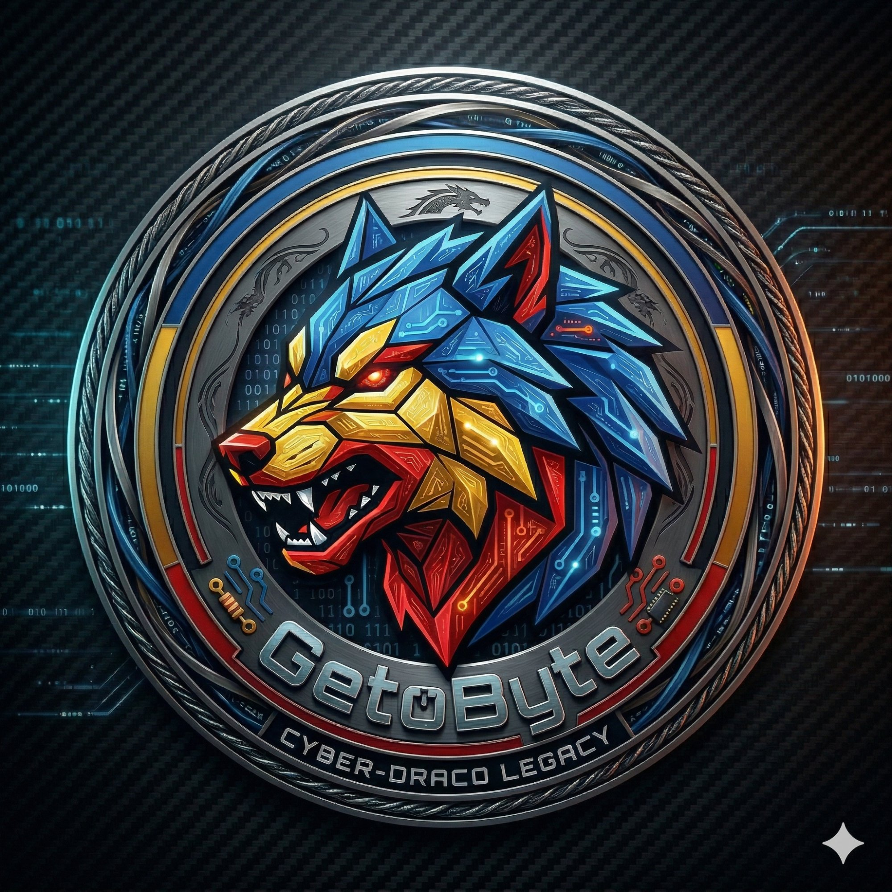

<div align="center">

[](https://github.com/getobyte)

</div>

---



### `> whoami`

Sunt un developer din România care construiește chestii de la zero — de la full-stack web apps la homelab infrastructure.

Îmi place să înțeleg cum funcționează lucrurile *sub capotă*: overclocking GPUs, optimizare Windows la nivel de kernel, Docker pe WSL2, networking, și tot ce ține de self-hosted.

**Main PC** rămâne curat — zero bloat. **Homelab PC** face treaba grea: Docker, self-hosted services, local servers.

```yaml
location: Romania 🇷🇴
role: Full-Stack Developer & Homelab Architect
currently_building: Cool stuff
philosophy: "Dacă nu știi DE CE merge, nu merge."
```

<br clear="right"/>

---

### ⚡ Tech Stack

<div align="center">

**`// Languages`**


**`// Frameworks & Tools`**


**`// Infrastructure`**


</div>

---

### 🖥️ Homelab Setup

```
┌──────────────────────────────────────────────────────────┐
│                    🏠  HOME NETWORK                      │
│                                                          │
│  ┌─────────────────┐         ┌─────────────────────┐     │
│  │   🎮 MAIN PC    │         │   🖥️ HOMELAB PC     │     │
│  │                 │  LAN    │                     │     │
│  │  Ryzen 9800X3D  ├────────►│  i9-14900K          │     │
│  │  RTX 5080       │         │  RTX 3080 12GB      │     │
│  │  96GB DDR5      │         │  32GB DDR5          │     │
│  │                 │         │                     │     │
│  │  Windows 11     │         │  Win11 + WSL2       │     │
│  │  Clean. Zero    │         │  Docker Desktop     │     │
│  │  bloat.         │         │  All services here  │     │
│  └─────────────────┘         └─────────────────────┘     │
│                                                          │
│              Elgato HD60X capture card link               │
│         PC1 → HD60X → PC2 → OBS → Headphones            │
│                                                          │
│  🌐 Router: D-Link DIR-X1560 (AX1500 Wi-Fi 6)           │
│  🔒 Everything local — nothing exposed to internet       │
└──────────────────────────────────────────────────────────┘
```

---

### 📊 GitHub Stats

<div align="center">


</div>

---

### 🐺 Principii

```
 ╔══════════════════════════════════════════════════════╗
 ║                                                      ║
 ║   🔒 Security is not an afterthought — it's baked    ║
 ║      into every config, every service, every port.   ║
 ║                                                      ║
 ║   🧹 Keep it clean — if it doesn't need to be        ║
 ║      there, it shouldn't be there.                   ║
 ║                                                      ║
 ║   🔍 If you don't know WHY it works,                 ║
 ║      it doesn't work.                                ║
 ║                                                      ║
 ║   ⚡ Build from scratch. Understand the layers.       ║
 ║      No magic. No black boxes.                       ║
 ║                                                      ║
 ╚══════════════════════════════════════════════════════╝
```

---

<div align="center">

### 🐺 `{ getobyte }` — Geto-Dacii × Code


---

<sub>*"Lupul dac nu latră — construiește."*</sub>

</div>
