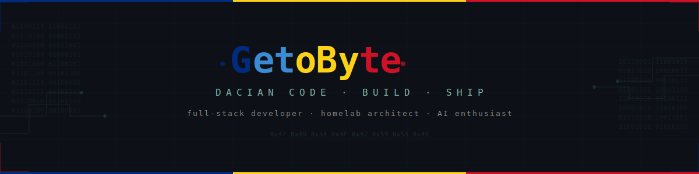

<div align="center">

[](https://github.com/getobyte)

<h4>⚔️ CYBER-DRACO LEGACY ⚔️</h4>

</div>

---

### `> whoami`

Sunt un developer din România care construiește totul cu AI — de la web apps la homelab infrastructure.

Îmi place să înțeleg cum funcționează lucrurile *sub capotă*: AI/ML pipelines, overclocking GPUs, Docker pe WSL2, networking, și tot ce ține de self-hosted.

**Main PC** rămâne curat — zero bloat. **Homelab PC** face treaba grea: Docker, self-hosted services, local AI models.

```yaml
location: Romania 🇷🇴
role: AI-Powered Developer & Homelab Architect
currently_building: Cool stuff with AI
philosophy: "Dacă nu știi DE CE merge, nu merge."
```

---

### ⚡ Tech Stack

<div align="center">

**`✦ Languages`**


**`✦ Web Stack`**


**`🧠 AI / ML Stack`**


**`🤖 Open Source AI Tools`**


**`🏢 AI Companies & Platforms`**


</div>

---

### 📊 GitHub Stats

<p align="center">
  
  &nbsp;&nbsp;
  
</p>

<p align="center">
  
</p>

---

<div align="center">

### 🐺 Principii

</div>

<div align="center">

```
 ╔══════════════════════════════════════════════════════╗
 ║                                                      ║
 ║   🔒 Security is not an afterthought — it's baked    ║
 ║      into every config, every service, every port.   ║
 ║                                                      ║
 ║   🧹 Keep it clean — if it doesn't need to be        ║
 ║      there, it shouldn't be there.                   ║
 ║                                                      ║
 ║   🔍 If you don't know WHY it works,                 ║
 ║      it doesn't work.                                ║
 ║                                                      ║
 ║   ⚡ Build from scratch. Understand the layers.       ║
 ║      No magic. No black boxes.                       ║
 ║                                                      ║
 ╚══════════════════════════════════════════════════════╝
```

</div>

---

<div align="center">

### 🐺 `{ getobyte }` — Geto-Dacii × Code


---

<sub>*"Lupul dac nu latră — construiește."*</sub>

</div>
